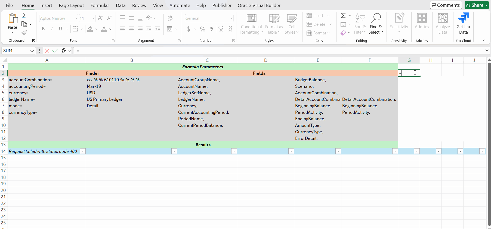

# OraGlBalEx Excel-DNA Add-In

## 📄 Table of Contents

- [🚀 Features](#-features)
- [🛠 Prerequisites](#-prerequisites)
- [📝 Installation](#-installation)
- [⚙️ Configuration](#-configuration)
- [📜 Logging](#-logging)
- [📝 License](#-license)
- [📫 Contact](#-contact)
- [📚 Additional Resources](#-additional-resources)

## 🚀 Features
- **OraGlBalEx** is a Excel-DNA add-in that seamlessly integrates Oracle [Fusion General Ledger (GL) API Balance](https://docs.oracle.com/en/cloud/saas/financials/24d/farfa/op-ledgerbalances-get.html) data directly into Microsoft Excel. By eliminating intermediate steps between Oracle Fusion and Excel, OraGlBalEx streamlines the data retrieval process, enabling to access and analyze GL balances efficiently.
Utilizing a single, intuitive Excel function, OraGlBalEx fetches data from the Oracle GL API and enhances it by parsing separation key flexfields into distinct columns. This automation fit for various ad-hoc reporting scenarios, including the generation of trial balances and other financial statements.
Below is the possible use case scenario.

## 🛠 Prerequisites

Before installing OraGlBalEx, ensure you have the following prerequisites:

- **Microsoft Excel:** Version compatible with Excel-DNA add-ins (Excel 2007 and later).
- **.NET 6.0:** Ensure that the [.NET 6.0 runtime](https://dotnet.microsoft.com/en-us/download/dotnet/6.0) is installed on your machine.
- **Oracle Fusion REST API Access:** Valid credentials and necessary permissions to access Oracle GL Balances APIs (only basic authorization here).
- **PowerShell (Optional):** For managing credentials and environment setup.

---

## 📝 Installation

Download the ORAGLBALEX-AddIn64-packed.xll file from the latest release on the right.
Right-click on the ORAGLBALEX-AddIn64-packed.xll file and unblock it.

#### OR

Open Excel
Launch Microsoft Excel:
Open Excel as you normally would.
Access the Add-Ins Manager
Navigate to Add-Ins:

Click on the File tab in the ribbon.
Select Options at the bottom of the sidebar.
Open Add-Ins Settings:

In the Excel Options window, click on Add-Ins in the left-hand menu.
Manage Add-Ins:

At the bottom of the window, you'll see a Manage dropdown.
Select Excel Add-ins and click Go....

Browse and Select the .xll File
Add New Add-In:

In the Add-Ins dialog, click on the Browse... button.
Navigate to the .xll File:

Browse to the location where the OraGlBalEx.xll file is located (as identified in the previous section).
Select the Add-In:

Select OraGlBalEx.xll and click OK.

After browsing, the add-in should appear in the Add-Ins list.
Ensure that the checkbox next to OraGlBalEx is checked.

## ⚙️ Configuration

### 1. Authentication Setup
   OraGlBalEx utilizes Basic Authentication to connect to the Oracle Fusion REST API. The following credentials and information are required:

Oracle API Username (oracleuser): The username designated for authenticating with the Oracle Fusion API.

Oracle API Password (oraclepassword): The corresponding password for the Oracle API user.

Oracle Fusion REST API Base URL (baseAPIUrl): The base URL of your Oracle Fusion REST API, typically in the format:

https://servername.fa.us2.oraclecloud.com:443

### 2. Storing Credentials Securely
   To enhance security and convenience, OraGlBalEx stores the required credentials and API base URL as secrets in the Windows Credential Manager. This approach ensures that sensitive information is securely stored and easily accessible by the add-in without exposing credentials directly within Excel or scripts.

a. Using Excel User-Defined Functions (UDFs) to Store Secrets
OraGlBalEx provides Excel functions to manage secrets directly within Excel, offering a user-friendly interface for storing and managing sensitive information.

StoreSecret Function:

=StoreSecret("key: value")

Parameters:

input (string): A single string in the format "key: value".

Example Usage:

=StoreSecret("oracleuser: your_username")
=StoreSecret("oraclepassword: your_password")
=StoreSecret("baseAPIUrl: https://servername.fa.us2.oraclecloud.com:443")

Function Description:

Store Secret: Saves the provided key-value pair in the Windows Credential Manager as a generic credential.
Error Handling: Returns descriptive error messages if the input format is incorrect or if the storage process fails.

b. Using Windows Credential Manager
Alternatively, you can manage secrets directly using the Windows Credential Manager application or via the command line. This method is suitable for users who prefer managing their credentials outside of Excel.
Add entries for oracleuser, oraclepassword, and baseAPIUrl.

c. Managing Secrets via Command Line (Advanced Users)
For advanced users or those automating the setup process, credentials can also be managed via the command line using appropriate scripts or commands. Refer to the Windows Credential Manager Documentation for detailed instructions.

### 4. Configuration Summary
Authentication: Basic Authentication using oracleuser and oraclepassword.
API Base URL: baseAPIUrl (e.g., https://servername.fa.us2.oraclecloud.com:443).
Credential Storage: Managed securely via Windows Credential Manager, accessible through Excel UDFs or directly through the Credential Manager application.
### 4. Demonstration Video
   To provide a clear and practical understanding of the configuration process, a demonstration video showcasing how to store secrets using Excel functions and manage credentials in Windows Credential Manager is provided below.

## 📜 Logging
Upon initialization, OraGlBalEx automatically creates a logs directory in the same location as the OraGlBalEx.xll add-in file. This centralized directory is designated for storing all log files related to the add-in's operations.

## 📫 Contact
If you have questions, feel free to reach out via GitHub Issues or [email@sergey.rudenko.ba@gmail.com].

## [📝 License]
This project is licensed under the MIT License. See the LICENSE file for more details.

## 📚 Additional Resources
- Excel-DNA Documentation:
[Excel-DNA Official Documentation](https://excel-dna.net/)
- REST API for Oracle Fusion Cloud Financials:
[REST API for Oracle Fusion Cloud Financials](https://docs.oracle.com/en/cloud/saas/financials/24d/farfa/op-ledgerbalances-get.html)

